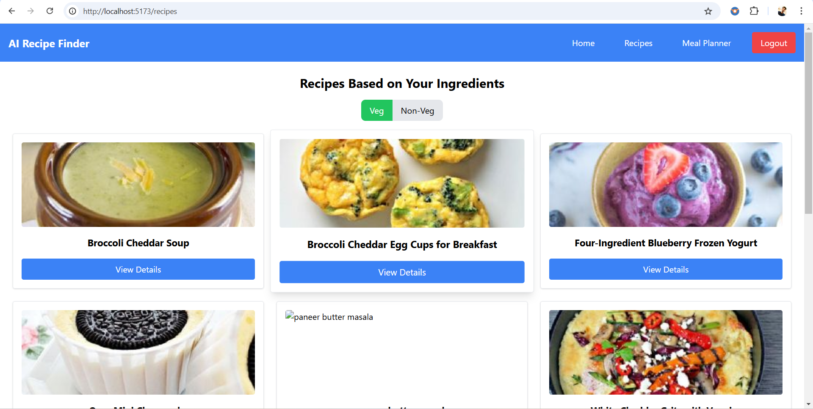

# Overview
This is an AI-powered recipe finder website designed to make cooking simple and enjoyable. Enter the ingredients you have, and this will suggest recipes tailored to your pantry. Whether you're a seasoned chef or a beginner, This offers personalized meal ideas, filters for dietary preferences, and step-by-step instructions to elevate your cooking experience.

Click <a href="https://ai-recipefinder.netlify.app/">here</a> to Access the site.
 
# Features

## Core Features

### Ingredient-Based Recipe Finder
- Enter ingredients you have at home, and CookCompass will suggest recipes you can make.

### Dietary Filters

- Choose from Vegetarian, Non-Vegetarian, or All recipes to match your preferences.

### Recipe Details
- View recipes with detailed descriptions, ingredients, images, and step-by-step instructions.

### Login and Signup
- Secure user authentication system to save your preferences and access recipes seamlessly.

### Responsive Design
- Optimized for desktops, tablets, and mobile devices.

### Technologies Used

- Frontend: React.js (with React Router)

- State Management: Context API

- CSS Framework: Tailwind CSS

- API Integration: Spoonacular API for fetching recipes

- Storage: LocalStorage for saving user login data and session management

### ScreenShots

## Login page

## Signup page

## Home page

## Food showcase card page

## Meal planner page

## Meal planner page

## Recipe Description page

